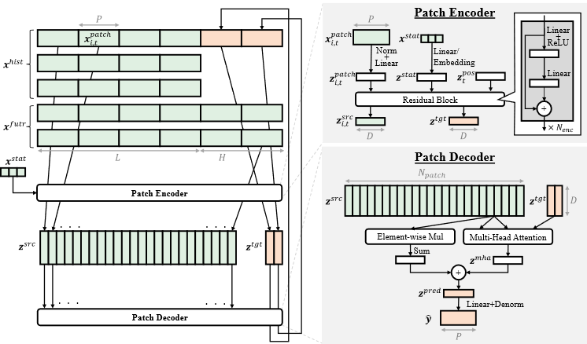

# PatchDecomp
This is the official implementation of PatchDecomp.<br>


## Getting Started
To get srarted, you can set up the environment using conda and `environment.yml` :
```
conda env create -f environment.yml
activate pd
```

## Usage

### Experiment
You can conduct experiments on two kind of datasets.
One is Long-term Time Series Forecasting (LTSF; ETTh1, ETTh2, ETTm1, ETTm2, Weather, ECL, and Traffic) and the other is [Electricity Price Forecasting](https://github.com/jeslago/epftoolbox) (EPF; PJM, NP, BE, FR, and DE).
Our proposed and existing methods were implemented using [NeuralForecast](https://github.com/Nixtla/neuralforecast).<br>
Usage:
```
python ltsf.py [--gpu <GPU ID>] [--seed <random seed>]
python epf.py [--unique_ids <unique IDs>] [--gpu <GPU ID>] [--seed <random seed>]
```
Examples:
```
cd PatchDecomp/src/experiments
python ltsf.py --gpu 0 --seed 0
python epf.py --unique_ids BE --gpu 0 --seed 0
```

### Visualization
You can visualize the input and predicted time series of all the methods by running `PatchDecomp/src/notebook/visualize_all_models.ipynb` and also the decomposition of the predicted values by running `PatchDecomp/src/notebook/visualize_decomposition.ipynb`.

### Analysis

#### Critical Difference Diagrams
To statistically verify the performance differences between methods for the LTSF and EPF tasks, you can create critical difference diagrams.<br>
Usage:
```
python critical_difference_diagram.py --path <path>
```
Example:
```
cd PatchDecomp/src/analysis
python critical_difference_diagram.py --path ../../results/ltsf/
python critical_difference_diagram.py --path ../../results/epf/
```

#### Area Over the Perturbation Curve for Regression (AOPCR)
To quantitatively evaluate the interpretability of time series forecasting models, we introduced the concept of comprehensiveness and AOPCR.
You can calculate AOPCR for PatchDecomp (PatchDecomp or random) and TFT (TFT-patch or TFT-point).<br>
Usage:
```
python aopcr.py --path <path> [--method <method>] [--unique_ids <unique IDs>] [--gpu <GPU ID>] [--ks <removal ratios>] [--replace <how to replace>] [--seed <random seed>] [--testsize <test data size>]
python plot_aopcr.py --path <path> [--ks <removal ratios>] [--unique_ids <unique IDs>]
```
Example:
```
cd PatchDecomp/src/analysis
python aopcr.py --path ../../results/epf/BE/seed0_250724_133654/results/PatchDecomp/ --method PatchDecomp --unique_ids BE --gpu 0 --ks 5.0 7.5 10.0 12.5 15.0 --replace global-mean --seed 0 --testsize 10464
python plot_aopcr.py --path ../../results/epf/BE/ --unique_ids BE --ks 5.0 7.5 10.0 12.5 15.0
```

### Local Explanartion
You can visualize local explanations from PatchDecomp.<br>
Usage:
```
python plot_local_explanation.py --path <path> [--unique_ids <unique IDs>] [--gpu <GPU ID>] [--seed <random seed>]
```
Example:
```
cd PatchDecomp/src/analysis
python plot_local_explanation.py --path ../../results/epf/BE/seed0_250724_133654/results/PatchDecomp/ --unique_ids BE  --gpu 0 --seed 0
```

### Global Explanation
You can visualize global explanation from PatchDecomp and TFT.
Make sure to run `aopcr.py` before runnning `plot_global_explanations.py`.<br>
Usage:
```
python plot_global_explanations.py --path_patchdecomp <path to PatchDecomp> --path_tft <path to TFT> [--gpu <GPU ID>]
```
Example:
```
cd PatchDecomp/src/analysis
python plot_global_explanations.py --path_patchdecomp ../../results/epf/BE/seed0_250724_133654/results/PatchDecomp/ --path_tft ../../results/epf/BE/seed0_250724_133654/results/TFT/ --gpu 0
```
